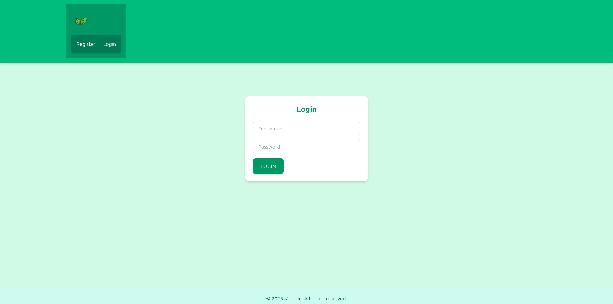
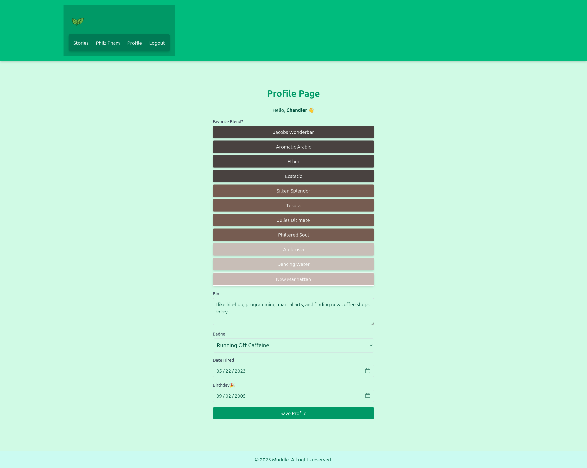
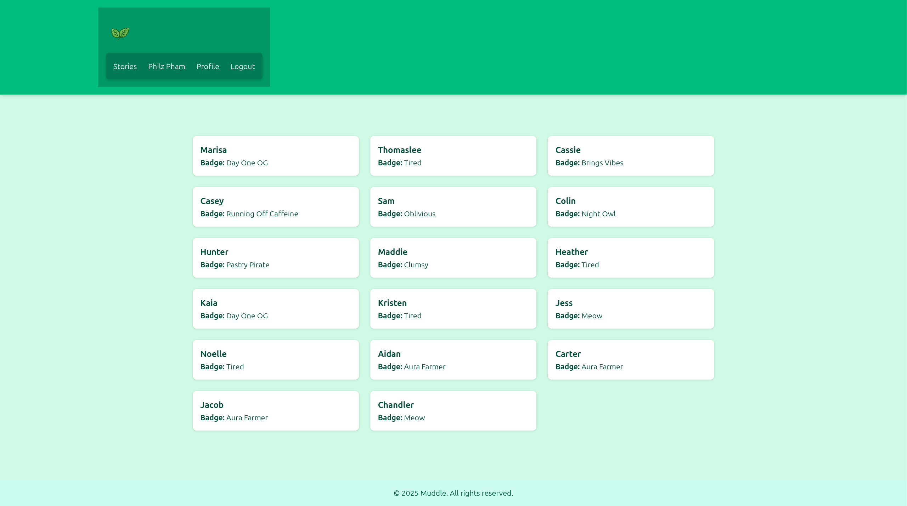
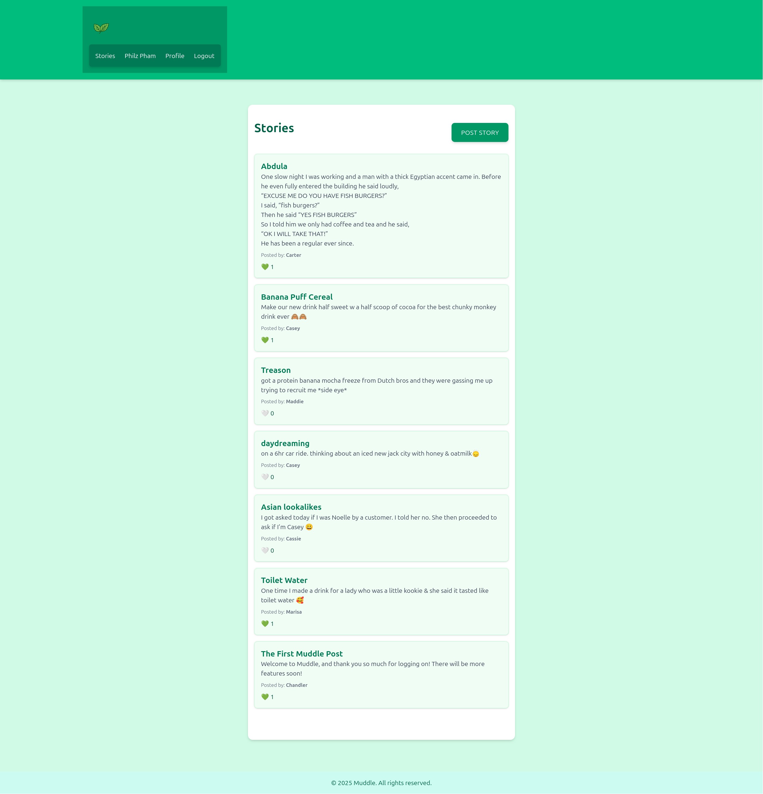
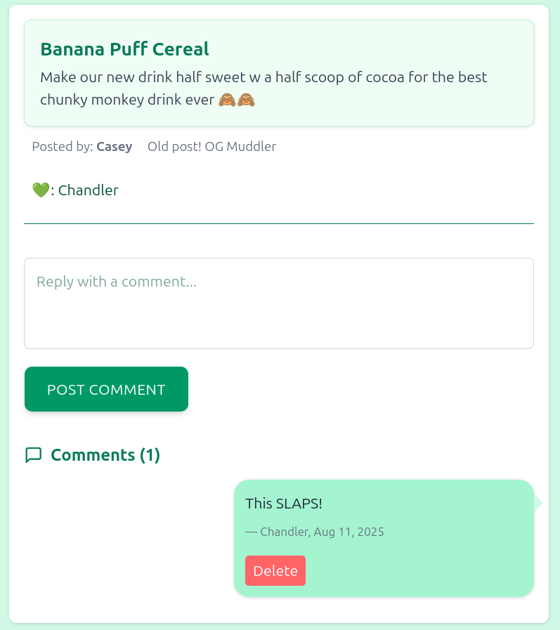

# Muddle 🚀

**A mobile-first web app for coworker discussions (“stories”) and announcements!**  

   

---

## 🔥 Features
- **User Authentication**: Registration & login with JWT.  
- **Story Management**: Create, view, and list stories tied to users.  
- **Protected Routes**: Profile page and story creation require authentication.  
- **Logout Functionality**: Securely log out users.  
- **Responsive Design**: Mobile-first UI with Tailwind CSS.  

---

## 🛠 Technologies Used

| Frontend | Backend | Database |
|----------|---------|---------|
| React (functional components, hooks) | Spring Boot | PostgreSQL or Supabase |
| React Router v6 | Spring Security + JWT |  |
| Axios | Hibernate & JPA |  |
| Tailwind CSS | Lombok & Validation Annotations |  |

---

## 📸 Screenshots

--- 
Frontend is available at: [Muddle Frontend](https://github.com/ckaycodes/muddle-frontend)

